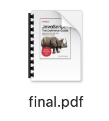

(a book i wanted to read on kindle in sep 2019 from oreilly that they claim would not be released until july 2020)

## getting motivated

while i had heard about the recurse center years ago and even visited i didn’t actually learn very much of the admissions process until this year. i had been considering doing the program but i didn’t get motivated until after meeting with a few rc grads while i was in berlin for jsconf eu in early june. the perspective i got from them was that i was not alone in feeling like i wasn’t skilled enough in programming to make good use of a self directed program. i personally felt most deterred by my own lack of focus and direction in any particular technical subject.

i was already getting depressed after attending !!con in nyc a few weeks before my berlin trip. while i was inspired by the talks there i was becoming quite sad at what a joyless routine coding had become for me personally. for a few months i built up a lot of internal pressure to get interested in programming again and find ways to manifest something (anything) interesting to me in code.

> ‘we think we understand the rules when we become adults but what we really experience is a narrowing of the imagination.’

i put this quote in my rc application somewhere and while it feels like such a corny thing to do i was really feeling nagged by it at the time. in the fall, the climate strike happened in nyc and the urgency of everyone who participated was deeply affecting to me.

## applying

the rc application is both really long and really short. writing is weirdly difficult for me and takes forever so actually i spent quite a long time reading over the written application before sending it off. this part has a couple open-ended questions like ‘what is something that you find fascinating’ in addition to coding samples.

## visiting

if you’re lucky enough to be in nyc, rc hosts monthly lightning talks (localhost) where you can take a tour and see what folks are working on in batch. i went while i was applying to make sure the space still seemed like a good place for me to do the work i intend to do. and yes, it was a super friendly environment with many interesting people of every background. i went to localhost with a friend and notably someone who was in a current batch realized that they knew my friend from years ago through the wifi network (didn’t know this but iOs let’s you share wifi credentials when your contacts are nearby?).

## interviews

given that most software jobs require hours of investment in coding challenges and day-long on sites, rc has an extremely slim interview process that takes place via video conference. one is conversational and the other is a pairing session. i personally felt like the conversational portion was just me ranting for 20 minutes straight about random things in and becoming really itchy and irritated in a poisonous phone booth. i was asked about both technical interests and approaches as well as more basic ‘why do you want to attend’ type stuff. i told my interview that i was nervous about getting laid off soon and they were very accomodating of this uncertainty. i was invited to schedule a pairing interview later that day.

for the pairing interview i decided to bring my own code which was good and bad. i had built a tic tac toe game before and really did not feel like doing that (lol). and anyway i was in the process of writing a script to convert web-only books to pdf and just really wanted to make it work.
